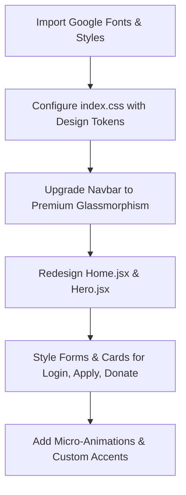

# World-Class UI Design Proposal: Sardar Kartar Singh Jhabbar Trust

This proposal is designed to elevate the **Sardar Kartar Singh Jhabbar Trust** web portal into a stunning, world-class digital experience. It combines a deep connection to Sikh heritage (Seva, humility, leadership) with a modern, high-tech, and premium educational look that will inspire trust and command respect from both donors and students.

---

## 🎨 Premium Visual Concept & Mockup

Here is the custom-generated high-fidelity design mockup for the home page. It represents a state-of-the-art web interface designed to leave a lasting first impression:


> [!NOTE]
> This mockup features a rich combination of Deep Royal Navy Blue (representing stability and depth) and Warm Amber Gold (representing spirituality, devotion, and premium status), coupled with ultra-modern typography and glassmorphic card elements.

---

## 💎 Design Strategy: What Makes it "Best in World"

To make the client say **"WOW"**, we suggest transitioning the current basic Bootstrap layout to a curated modern design language using these core pillars:

### 1. The Divine & Professional Color Palette
*   **Primary Deep Blue (`#0B192C`)**: The base background color for primary sections, footer, and brand identity. This conveys high trust and security.
*   **Sikh Heritage Gold/Amber (`#D4AF37` / `#F1C40F`)**: Used selectively for primary buttons, active links, icons, borders, and crucial highlights.
*   **Clean Soft Light (`#F8F9FA` to `#FFFFFF`)**: Used for background sections to maintain light, airy, and legible body contents.

### 2. High-Impact Typography (Google Fonts)
*   **Headings**: **`Playfair Display`** or **`Cinzel`** (Serif) — adds a historical, majestic, and premium editorial feel that honors the legacy of *Sardar Kartar Singh Jhabbar*.
*   **Body Text**: **`Outfit`** or **`Inter`** (Sans-serif) — provides razor-sharp readability, modern spacing, and geometric cleanliness.

### 3. Split-Screen / Full-Bleed Modern Hero Section
*   Instead of a simple gray background, a premium layout uses a split-screen or a layered layout:
    *   **Left Side**: Heavy typography, high-contrast gold details, and a clear primary dual Call-to-Action (e.g., gold solid "Donate Now" next to a ghost-style outline "Explore Scholarships").
    *   **Right Side**: An elegant, gold-bordered image frame featuring active student life and the inspiring portrait of the Trust's legacy.

### 4. Glassmorphism & Hover Micro-Animations
*   Using subtle backdrops (`backdrop-filter: blur(12px)`) for navbar, cards, and modal components.
*   Cards that elevate smoothly on hover:
    ```css
    .premium-card {
      transition: all 0.3s cubic-bezier(0.25, 0.8, 0.25, 1);
    }
    .premium-card:hover {
      transform: translateY(-8px);
      box-shadow: 0 15px 30px rgba(0, 0, 0, 0.1);
      border-color: #D4AF37;
    }
    ```

### 5. Transparency & Trust Builders (Visual Stats)
*   Donors want to see the *impact*. We will add a gorgeous counter section:
    *   **500+** Underprivileged Students Educated
    *   **100%** Transparent Donation Pipeline
    *   **12+** Sikh Heritage Seva Initiatives

---

## 🛠️ The Technical Implementation Plan

We can implement these visual changes directly into your React codebase without breaking any backend functionality. Here are the key steps:



### Proposed File Enhancements:

1.  **[index.css](file:///e:/hostinger/ngo-Portal/frontend/src/index.css)**: Set up the modern font configurations, root variables, custom buttons, custom animations, and scrollbars.
2.  **[index.html](file:///e:/hostinger/ngo-Portal/frontend/index.html)**: Integrate beautiful modern Google fonts (`Cinzel` & `Outfit`).
3.  **[Hero.jsx](file:///e:/hostinger/ngo-Portal/frontend/src/components/Hero.jsx)** & **[Home.jsx](file:///e:/hostinger/ngo-Portal/frontend/src/pages/Home.jsx)**: Convert the basic text sections into elegant, structured components with premium imagery, stats, and a responsive layout.
4.  **[Navbar.jsx](file:///e:/hostinger/ngo-Portal/frontend/src/components/Navbar.jsx)** & **[Footer.jsx](file:///e:/hostinger/ngo-Portal/frontend/src/components/Footer.jsx)**: Refine navigation styling with elegant hover underline animations, premium brand logo integration, and a rich, high-end footer layout.
